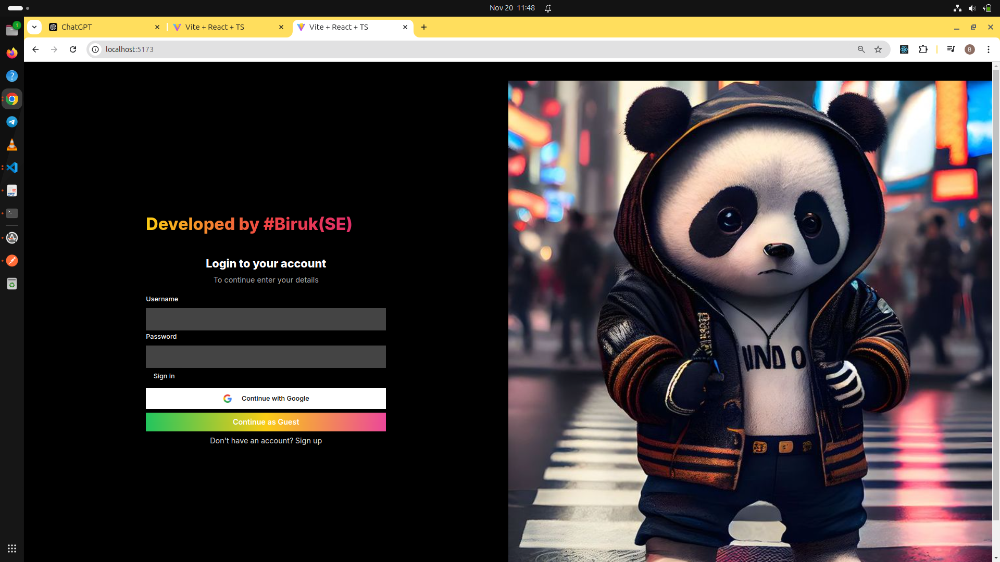

# DarkBoy - Music Streaming Web Application 🎶

**DarkBoy** is a full-stack music streaming web application that allows users to stream their favorite music tracks, create playlists, and enjoy a seamless listening experience. Built with modern technologies, **DarkBoy** combines an intuitive user interface with a robust backend to provide a smooth and responsive experience for music lovers.

  <!-- Replace with your actual screenshot URL -->

## 🚀 Features

- **Stream Music**: Listen to high-quality music from a wide selection of tracks.
- **Google Authorization**: Secure login and user management.
- **Responsive Design**: Optimized for both desktop and mobile devices.
- **Music Player Controls**: Play, pause, skip, and adjust volume.
- **Customizable Themes**: Choose between light or dark mode for the player interface.

## 🔧 Technologies Used

- **Frontend**: 
  - React.js
  - Tailwind CSS
  - HTML5, CSS3
- **Backend**:
  - Node.js
  - Express
  - MongoDB

- **Deployment**:
  - Vercel for the frontend and render for the backend

## 📦 Installation

To run the project locally, follow these steps:

### 1. Clone the repository:
```bash
git clone https://github.com/your-username/darkBoy.git
